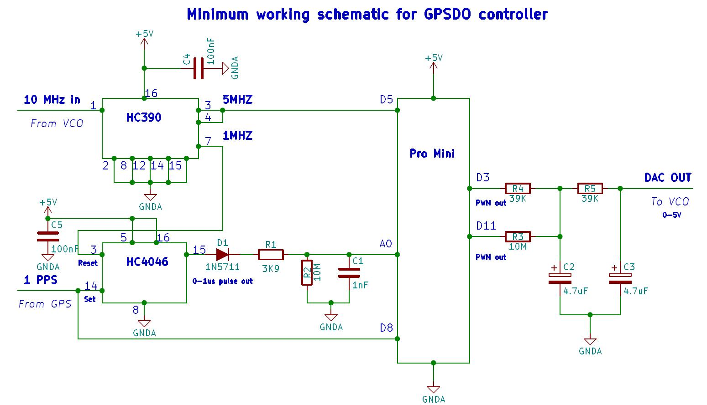

# Lars DIY-GPSDO (GPS Disciplined Oscillator)

These are the original files for **Lars' DIY GPSDO EEVblog** project by **Lars Walenius** as published in the EEVblog thread.

 https://www.eevblog.com/forum/projects/lars-diy-gpsdo-with-arduino-and-1ns-resolution-tic/

## Schematic



## Software

Software can be found in [Software](Software/) directory. Go there and read how to contribute.

## Lars Introduction

Lars first post on EEVblog Forum explaining why he created his project:

```text
Lars DIY GPSDO with Arduino and 1ns resolution TIC
« on: 2017-08-11, 12:18:19 »

Yet another DIY GPSDO! On the internet you can find a lot of DIY GPSDO designs. What are the differences between them? Why this?
Some + and – I can come up with for mine:

+ 1ns resolution TIC (Time Interval Counter)
+ PLL (not FLL)
+ Uses Arduino (ok some might say it is negative)
+ Low parts count and cheap components
+ No need for a specific GPS receiver only requires 1PPS in
+ Easy adaption to different oscillators (from simple VCXO to Rubidium)
+ Configuration for VCO range, time constant (4-32000s) and a lot of other parameters
+ Outputs time error (ns), DAC value and temperature (and a lot of other information) to the serial port
+ Logs time error, DAC value and temperature every third hour
+ Stores last DAC value for use at power-up
-DAC resolution (now 16bits) and stability could be better
-No saw tooth correction
-No adaptive time constant
-Not using information from receiver e.g. number of satellites etc.
-No standardized communication protocol like many commercial GPSDO’s
-No display

Why did I do this? Since about 2010 I have developed my GPSDO. It started just because I was lazy and tired of tweaking my 10MHz house standard. The only thing I am proud of is the 1ns resolution TIC. A couple of years ago I published an old version on the time nuts forum. This time I decided to use this forum instead as I think my DIY GPSDO is something for experimenters in this forum.

For me it is perfect for experiments. I have learned a lot during the years I have used it (and developed it).

I have built several complete GPSDO’s but now the only one I have running continuous is a rubidium based DIY Arduino GPSDO I use as a lab standard for my instruments. That Rb GPSDO has been running almost continuous for more than five years with different versions of my Arduino software.

Today you can get a GPS module + antenna for about 10USD from eBay, an OCXO for 10-20USD, a metal box and connectors for about 10USD, the Arduino pro mini and all other components for about 10USD, So around 50-60USD should be enough to get all components for a complete GPSDO.
```

He also attached Instructions for his project  to his post. Merged PDF can be found here: [What is Lars Arduino based GPSDO Controller.pdf](What_is_Lars_Arduino_based_GPSDO_Controller.pdf)

## License

All files in this repository are copyright 2017 by **Lars Walenius**.
All files are under a GPLV3 license.

Apparently Lars was the only member of his family with any interest in electronics, and I believe he wanted other electronics hobbyists to have full access to his project, this is why putting the project under an Open Source license while retaining Lars Walenius copyrights seems the right thing to do.

These files are here in this repository for reference only. If you have any questions or comments about Lars' DIY GPSDO project please post them in the EEVblog thread.
